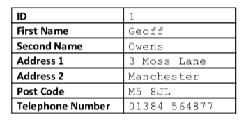

# Create a Python application based on the tasks below
## Project should be executed in bash/terminal, or windows command prompt.

## Introduction

This task is designed to assess the practical Python skills that you have learned during your training. You are to use the knowledge you have acquired from the course and demonstrate this. You are allowed to reference your materials and troubleshoot using Google, but PLEASE do not copy and paste from Google! If I find any solutions copied and pasted from Google in your code, I will deduct a mark from your score.

Please download this file to the folder where you will be saving your python file: ​text file The file is tab-separated.

The ID field must be ​Unique​; you cannot have 2 records in the text file that share the same ID. The text file will not include the names of the rows (the ​Bold ​text), check the supplied text file for
how the data will look exactly.
You are tasked with working with this text file to create the functions set out below. The tasks are split into different sections of difficulty for your convenience.
When you have finished, please rename your python file so that it follows the following convention:
YOURNAME_python.py

All code should be in the one file to be marked appropriately. Make sure you replace YOURNAME with your actual name :P You can then upload your python file here:

https://forms.gle/QHXVrh9vR23ktnXZA

Marks
You will be graded out of 100%. One mark will be awarded for each task completed, and an additional point will be awarded for tidy code that is easy to read, and a bonus point for effective use of comments, for a total of ​9 marks​.
Good luck!

## Tasks

### Section 1

1. Create a function which reads data from the downloaded file and prints it in one print statement. (1 mark)

2. Create a function that can add a person to this downloaded text file following the existing format i.e.
5 Bill Herald 34 new st Birmingham B36 7TH 09789583653
The data for this person should be taken as user input. Remember the ID should be unique, so the program should auto-generate the next ID, not accepted as an input. (1 mark)

3. Create a function to remove a particular person from this text file, the user should be able to pick which person they remove by specifying an ID (1 mark)

### Section 2

1. Create a function that can list information about a person that exists in the text file. The user should be able to choose which field to search by. (1 mark)

2. Create a function that can make a copy of the text file to be used as a back-up.
(hint: research shutil.copy()) (1 mark)

3. Create a function to update a person that already exists in the text file, the user should be able to pick which record they update and which field in the record they change.
(hint: research .strip() to remove new line characters) (1 mark)

### Section 3

1. If there are duplicate results for the field they searched by (in section 2), display all records in a formatted fashion. (1 mark)
